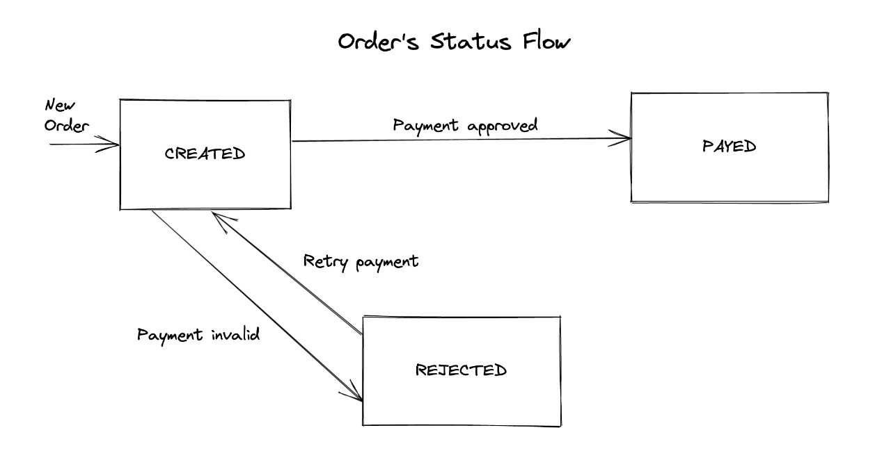

# Store Payment 

## Diseño

### Ordenes:

Tabla: `orders`

Almacena los datos del cliente y la nueva orden.

* Las ordenes son creadas por un cliente cuando se inicia un proceso de pago.
* Las ordenes se actualizan cuando:
    * Cuando se verifique el pago con la pasarela de PlacetoPay
    * Si se rechaza el pago
    * Si el cliente reintenta el pago

### Pagos

Tabla: `payments`

Almacena la informacion del pago y el estado del mismo 

* Son generados cuando se inicia un pago
* Estan relacionados con una orden
* El registro se actualiza con la informacion de la pasarela de pagos.

| llave | nombre | tipo |
|---|---|---|
| PK | id | integer |
| FK | order_id | integer |
| | status | string(20) |
| | session_id | string(100) |
| | request_id | integer |
| | process_url | string(100) |
| | nonce | string(10) |
| | seed | string(30) |

### Constantes

En el directorio `\config` se crearon 2 archivos para definir constantes:
* `orders.php`
* `payments.php`

## Configuración 

* Crear archivo .env copiando el .env.example
* Crear archivo .env.testing copiando el .env.example (configurar base de datos de testing)
* Configurar datos para la Base de datos
* Configurar datos para la pasarela de Place to pay

1.) Ejecutar comando: `composer install`

2.) Ejecutar comando: `php artisan migrate`

3.) Ejecutar comando: `php artisan migrate --env=testing` (base de datos para los test)

4.) Ejecutar comando: `php artisan serve` e ingresar a la URL en el navegador

## Test

El proyecto cuenta con test tanto unitarios como de integracion los cuales estan ubicados en la siguientes rutas:
* `\test\Feature\OrdersTest.php`
* `\test\Feature\PaymentsTest.php`
* `\test\Unit\PaymentsTest.php`
* `\test\Unit\PlaceToPayTest.php`

Para ejecutar los test se debe correr el siguiente comando:

`php artisan test --env=testing`

